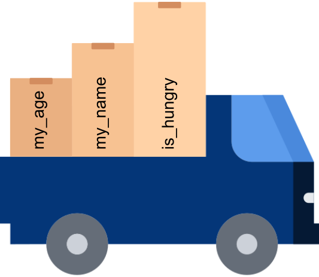

# Collections {.unnumbered}

{fig-align="center" width=40%}

<p font-size=55pt align="center">
**Collections allow us to move groups of information.**
</p>

We will explore ```Tuples```, ```Lists```, ```Sets```, ```Dictionaries```. Other useful collections include ```Arrays``` and ```DataFrames```. 

## Lists & tuples

Lists and tuples are both an ordered collection of *any* number and *any* type of items. 

<p font-size=55pt align="center">
```my_list = [val1, 'val2', 3]```
</p>

<p font-size=55pt align="center">
```my_tuple = (val1, 'val2', 3)```
</p>

These collections can be created directly using their parentheses. You can also use the equivalent built-in function to convert between collection types:
```{python}
#| echo: True
a = [1, 3, 9, 27]
b = (1, 3, 9, 27)
c = list(b)
print(a, b, c)
```

The key difference between these two collections is ***mutability***.Individual elements of lists can be updated, added or removed after creation making them *mutable*. In contrast, tuples are *immutable* - items can be retreived but not altered.

## Indexing & slicing

We can access individual elements in lists or tuples according to their ```index```.

::: {.callout-important}
### Python is *zero indexed*, meaning it starts counting at zero.
:::

```{python}
# | echo: True
a = [1, 3, 9, 27]
a[0] = 2
print(a)
```

```{python}
# | echo: True
a.append(27*3)
print(a)
```

```{python}
# | echo: True
a.remove(a[-2])
print(a)
```

```{python}
# | echo: True
a[0:2] = 'H'
print(a)
```

```{python}
# | echo: True
# | error: True
c = ('G','C','A','T')
print(c[0])
```

However, remember they are immutable:

```{python}
# | echo: True
# | error: True
c[2] = 'hello'
```

Strings are essentially a ```tuple``` of characters that can be sliced and indexed. 

```{python}
#| echo: True
my_seq = 'GAT CTA GTC TAG CTA'
print(
    f'First: {my_seq[0]}', 
    f'Slice: {my_seq[2:7]}', 
    f'Another slice: {my_seq[:2]}')
```

However, remember they are immutable:
```{python}
#| echo: True
#| error: True
my_seq[3] = 'g'
```

::: {.callout-note}
### You can check for the presence of a substring using the ```in``` operator:
:::
```{python}
#| echo: True
my_seq = 'GAT CTA GTC TAG CTA'
print('GTC' in my_seq)
print('TAG' not in my_seq)
```

## Sets

```Sets``` are an unordered collection of *unique* elements. 

<p font-size=55pt align="center">
```my_set = {val1, val2, val3}```
</p>

Python gives you access to a range of mathematical operations applicable to sets, including ```union```, ```intersection```, and ```difference```. 

Let's look at sets in action:

```{python}
#| echo: True
s1 = set([2, 4, 6, 8, 10])
s2 = {4, 5, 6, 7}

print("Union:", s1 | s2)
print("Intersection:", s1 & s2)
```

::: {.callout-note}
### Elements of a set must be those which cannot be internally modified.
:::

## Dictionaries

```Dictionaries``` offer a way to access information by name rather than index:

<p font-size=55pt align="center">
```dictionary = {key : value}```
</p>

```Keys``` must be unique and immutable, but ```values``` can be of any data type.

Let's see a few ways to add information to a dictionary:

```{python}
# |echo: True
# |output: False
my_dict = dict([('key1', 'val1'), ('key2', 'val2'), ('key3', 'val3')])

new_dictionary = dict(zip(['key1', 'key2', 'key3'], ['val1', 'val2', 'val3']))

genes = {
    'HSP70A1A': 1.2548,  'TMEM218':  0.5273,  
    'MYMK': -0.4869,  'SNAP23': 0.6749,  
    'TAF4': -2.6487, }
genes['SYNCA'] = 0.1547
genes['MYMK'] = 1.047
```


We can access the value associated with a key:
```{python}
# |echo: True
genes = {
    'HSP70A1A': 1.2548,  'TMEM218':  0.5273, 
    'MYMK': -0.4869,  'SNAP23': 0.6749, 
    'TAF4': -2.6487, }
print(genes['HSP70A1A'])
```

If you try to retrieve a key that doesn't exist, you will receive a ```KeyError```.
```{python}
# |echo: True
#| error: true
print(genes['HSP90'])
```

... unless you use the ```.get()``` method!
```{python}
# |echo: True
print(genes.get('HSP90'))
```

You can get a list of ```keys```, ```values``` and even matched ```key```-```value``` pairs.

```{python}
# |echo: True
genes.keys()
```

```{python}
# |echo: True
genes.values()
```

```{python}
# |echo: True
genes.items()
```

::: {.callout-note}
### As of Python3, dictionaries are guaranteed to be ordered. 
:::

## In practice 

::: {.callout-caution}

### Exercises

2.1 Lists

2.2 Sets

2.3 Dictionaries

:::
