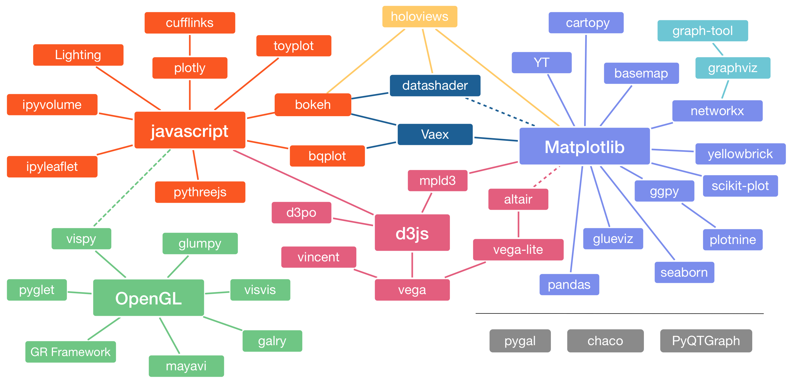
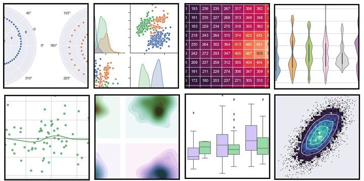
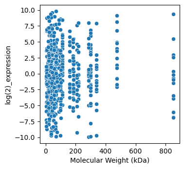
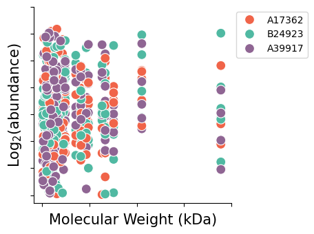
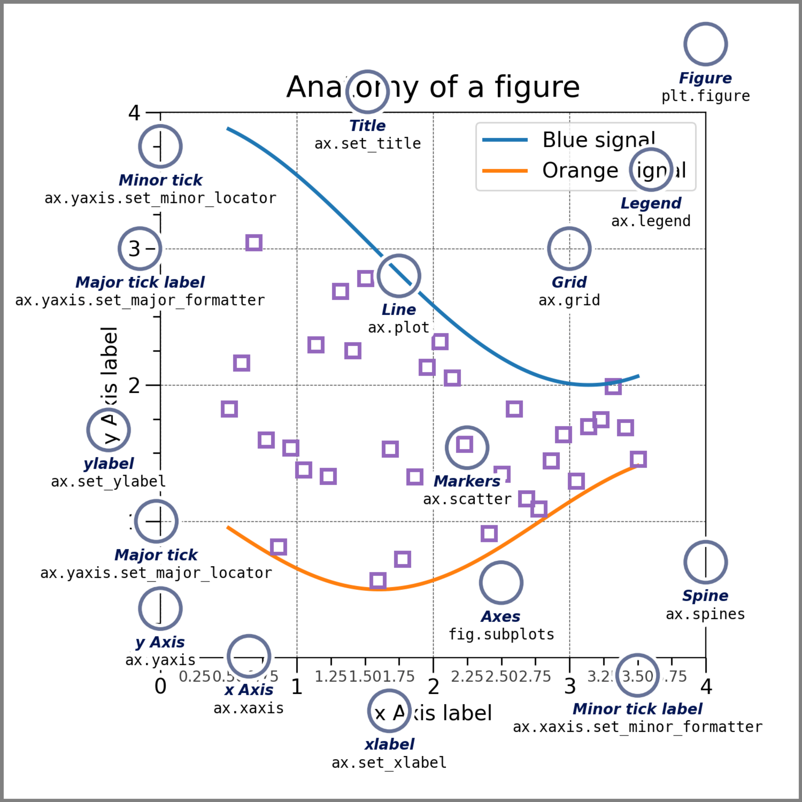

## Visualisation {.unnumbered}

> Data and information visualization is the practice of [**designing and creating**]() easy-to-communicate and easy-to-understand [**graphic or visual representations**]() of a large amount of complex quantitative and qualitative data and information with the help of [**static, dynamic or interactive visual items**]().

<p align="right"><small font-size="55pt"><em>
Wikipedia
</em></small></p>

The Python visualization landscape has many options to choose from - making it a little daunting at first! 

{width="850" fig-align="center"} 

<p align="right"><small font-size="55pt"><em>
Source: [PyViz](https://pyviz.org/overviews/), [Jake VanderPlas](https://www.youtube.com/watch?v=FytuB8nFHPQ)
</em></small></p>

## Seaborn 🫱🏻‍🫲🏻 Matplotlib

Today we will focus on getting comfortable using ```seaborn```, which is a nice wrapper over the basic functionality provided by ```matplotlib```.

::: {.callout-note}
### Both ```matplotlib``` and ```seaborn``` come pre-installed with Anaconda.
:::

To have access to the functionality of both libraries, we first need to ```import``` them. It is common to *alias* these libraries:

```{python}
#| echo: True
import seaborn as sns
import matplotlib.pyplot as plt
```
```{python}
#| echo: False
print(' ')
```
We also need a dataset!

```{python}
#| echo: True
import pandas as pd
proteins = pd.read_csv('data/example_proteins.csv')
```

Once imported, seaborn gives us access to many simple plots out of the box.

{width="1050" fig-align="center"} 


## The simple scatterplot

Let's start with a scatterplot, which is useful for visualising simple ```x```,```y``` datasets.

```{python}
#| echo: True
#| output: False
sns.scatterplot(
  data=proteins,
  x='Molecular Weight (kDa)',
  y='log(2)_expression',
)
```

```{python}
#| echo: False
#| output: True
#| fig-align: center
import matplotlib.pyplot as plt

fig, ax = plt.subplots(figsize=(3.7,3.7))
sns.scatterplot(
  data=proteins,
  x='Molecular Weight (kDa)',
  y='log(2)_expression',
)
```


We can add additional classifiers to separate the data by colour (```hue```) or ```style```.

```{python}
#| echo: True
#| output: False
sns.scatterplot(
  data=proteins,
  x='Molecular Weight (kDa)',
  y='log(2)_expression',
  hue='Time point (h)',
  style='Donor',
)
```

```{python}
#| echo: False
#| output: True
#| fig-align: center
fig, ax = plt.subplots(figsize=(3.7,3.7))
sns.scatterplot(
  data=proteins,
  x='Molecular Weight (kDa)',
  y='log(2)_expression',
  hue='Time point (h)',
  style='Donor',
)
```

## The basic boxplot

Similarly for a boxplot:

```{python}
#| echo: True
#| output: False
sns.boxplot(
  data=proteins,
  x='Donor',
  y='log(2)_expression',
  hue='Time point (h)',
)
```

```{python}
#| echo: False
#| output: True
#| fig-align: center
fig, ax = plt.subplots(figsize=(7,3.7))
sns.boxplot(
  data=proteins,
  x='Donor',
  y='log(2)_expression',
  hue='Time point (h)',
)
```


## The humble histogram

And for a histogram:

```{python}
#| echo: True
#| output: False
sns.displot(
  data=proteins,
  x='log(2)_expression',
  hue='Time point (h)',
  kind='hist'
)
```

```{python}
#| echo: False
#| output: True
#| fig-align: center
h = sns.displot(
  data=proteins,
  x='log(2)_expression',
  hue='Time point (h)',
  kind='hist',
)
h.fig.set_size_inches(7, 3.7, 10.5)
```


And for a histogram:

```{python}
#| echo: True
#| output: False
sns.displot(
  data=proteins,
  x='log(2)_expression',
  hue='Time point (h)',
  kind='kde'
)
```

```{python}
#| echo: False
#| output: True
#| fig-align: center
h = sns.displot(
  data=proteins,
  x='log(2)_expression',
  hue='Time point (h)',
  kind='kde',
)
h.fig.set_size_inches(7, 3.7, 10.5)
```


## The lazy lineplot

And for a lineplot:

```{python}
#| echo: True
#| output: False
sns.lineplot(
  data=proteins,
  x='Time point (h)',
  y='log(2)_expression',
  hue='Donor'
)
```

```{python}
#| echo: False
#| output: True
#| fig-align: center

proteins_filtered = []
for i, (donor, df) in enumerate(proteins.groupby(['Donor'])):
  if i == 0:
    proteins_filtered.append(df[df['log(2)_expression'] >= 0])
  if i == 1:
    proteins_filtered.append(df[(df['log(2)_expression'] < 2) & (df['log(2)_expression'] > -2)])
  if i == 2:
    proteins_filtered.append(df[df['log(2)_expression'] <= 0])
proteins_filtered = pd.concat(proteins_filtered)

fig, ax = plt.subplots(figsize=(7,3.7))
sns.lineplot(
  data=proteins_filtered,
  x='Time point (h)',
  y='log(2)_expression',
  hue='Donor'
)
```


## Choosing colours

::: {.callout-tip}
### Why does colour matter?
:::

Colours can help highlight patterns, distinguish categories, making visualisations more engaging and easier to interpret.


::: {.columns}
:::: {.column width="50%"}
```{python}
#| echo: false
#| output: true
import seaborn as sns
import matplotlib.pyplot as plt

# Example dataset
data = sns.load_dataset('penguins')

# Plot without colour
fig, ax = plt.subplots(figsize=(5, 5))
sns.lineplot(
  data=proteins_filtered,
  x='Time point (h)',
  y='log(2)_expression',
  hue='Donor',
  palette={'A17362': '#18191c', 'A39917': '#18191c', 'B24923': '#18191c'}
)
plt.show()
```
::::

:::: {.column width="50%"}
```{python}
#| echo: false
#| output: true
# Plot with colour

fig, ax = plt.subplots(figsize=(5, 5))
sns.lineplot(
  data=proteins_filtered,
  x='Time point (h)',
  y='log(2)_expression',
  hue='Donor',
)
plt.show()
```
::::
:::


```Matplotlib``` provides a variety of [built-in color palettes](https://matplotlib.org/stable/users/explain/colors/colormaps.html) for different types of data:

- [**Categorical**](): `deep`, `muted`, `pastel`, `dark`, `colorblind`
- [**Sequential**](): `Blues`, `Reds`, `Greens`, `Purples`
- [**Diverging** ](): `coolwarm`, `RdBu`, `Spectral`

:::{.fragment}
Built-in palettes can be accessed using the `palette` argument:
:::

::::: {.columns .fragment}
:::: {.column width="50%"}


```{python}
#| echo: true
#| output: False
sns.lineplot(
  data=proteins_filtered,
  x='Time point (h)',
  y='log(2)_expression',
  hue='Donor',
  palette='tab10'
)
```
::::

:::: {.column width="50%"}
```{python}
#| echo: False
fig, ax = plt.subplots(
  figsize=(4, 4)
  )
sns.lineplot(
  data=proteins_filtered,
  x='Time point (h)',
  y='log(2)_expression',
  hue='Donor',
  palette='tab10'
)
plt.show()
```
::::
:::::

## Creating a custom palette

For more control, you can create a [custom palette]() using a dictionary that maps specific categories to colours:

```{python}
#| echo: true
#| output-location: column
# Define a custom palette
custom_palette = {
  'A17362': '#28112B', 
  'A39917': '#BA324F', 
  'B24923': '#4BA3C3'
  }

# Apply the custom palette
sns.lineplot(
  data=proteins_filtered,
  x='Time point (h)',
  y='log(2)_expression',
  hue='Donor',
  palette=custom_palette
)
```


## In practice

::: {.callout-caution}

### Exercises

4.1 Creating a simple visualisation

4.2 Customising colour schemes

:::


## Makeovers with Matplotlib

So far, we have accepted the standard options that seaborn makes available to us. 

::: {.columns}
::: {.column}
{width="300" fig-align="center"} 
:::
::: {.column}
{width="350" fig-align="center"} 
:::
:::

However, 'under the hood' the figure is still created using ```matplotlib``` objects and often we need to return to ```matplotlib``` to style plot elements.

Matplotlib is typically imported and aliased as ```plt```:

```{python}
#| echo: True
import matplotlib.pyplot as plt

```

## The canvas

We first need to understand how matplotlib structures a figure.

{width="490" fig-align="center"} 

<p align="right"><small font-size="55pt"><em>
Source: [matplotlib](https://matplotlib.org/stable/gallery/showcase/anatomy.html)
</em></small></p>


## Styling

We can then edit different parts of the visualisation using methods provided by the ```fig``` or ```axes``` objects.

::: {.columns}
::: {.column width="60%"}
```{python}
#| echo: False
#| output: False
#| fig-align: center
custom_palette = {
   'A17362': '#F06449',
   'B24923': '#50B9A2',
   'A39917': '#8F6593'
}
```

```{python}
#| echo: True
#| output: False
fig, ax = plt.subplots(figsize=(3, 3))
sns.scatterplot(
  data=proteins,
  x='Molecular Weight (kDa)',
  y='log(2)_expression',
  hue='Donor',
  palette=custom_palette,
  s=100,
)
plt.ylabel('Log$_2$(abundance)')
plt.xlabel('MW (kDa)', fontsize=15)
ax.set_yticks(
  labels=[], 
  ticks=[-10, -5, 0, 5, 10])
plt.legend(bbox_to_anchor=(1.0, 1.0))
ax.spines['right'].set_visible(False)
ax.spines['top'].set_visible(False)

```
:::
::: {.column width="40%"}

```{python}
#| echo: False
#| output: True
#| fig-align: center
custom_palette = {
   'A17362': '#F06449',
   'B24923': '#50B9A2',
   'A39917': '#8F6593'
}

fig, ax = plt.subplots(figsize=(3, 3))
sns.scatterplot(
  data=proteins,
  x='Molecular Weight (kDa)',
  y='log(2)_expression',
  hue='Donor',
  palette=custom_palette,
  s=100
)
plt.ylabel('Log$_2$(abundance)')
plt.xlabel('MW (kDa)', fontsize=15)
ax.set_yticks(labels=[], ticks=[-10, -5, 0, 5, 10])
# ax.set_xticks(labels=[], ticks=[0, 200, 200, 400])
plt.legend(bbox_to_anchor=(1.0, 1.0))
ax.spines[['top', 'right']].set_visible(False)
ax.spines['top'].set_visible(False)

```
:::
:::

::: {.callout-note}
### In most styling use cases,  the ```plt``` and ```ax``` functions are interchangable.
:::

## Multiple panels

We can create figure layouts using a variety of methods.

:::: {.columns}
::: {.column}
```{python}
#| echo: True
#| output: True
#| fig-align: center
# a figure with a single Axes
fig, ax = plt.subplots()
```
:::

::: {.column}
```{python}
#| echo: True
#| output: True
#| fig-align: center
# a figure with multiple axes
fig, axes = plt.subplots(2, 2)

# Add to your axes by indexing
# axes[0, 1]
```
:::
::::

```{python}
#| echo: True
#| output: True
#| fig-align: center
fig, axes = plt.subplot_mosaic([['left', 'right_top'],
                               ['left', 'right_bottom']],
                               figsize=(7, 7))
```

## Saving

Last but not least - now we have a fabulous visualisation, it's time to save it! 

Matplotlib offers a number of file formats, including ```png``` and ```svg```.

```{python}
#| echo: True
#| output: False
plt.rcParams['svg.fonttype']= 'none' # This makes our font editable in vector graphics formats e.g. Photoshop/Inkscape

fig, ax = plt.subplots(figsize=(4, 4))
sns.scatterplot(
  data=proteins,
  x='Molecular Weight (kDa)',
  y='log(2)_expression',
  hue='Donor',
  palette=custom_palette,
)
plt.savefig('images/example_proteins.png')
plt.savefig('images/example_proteins.svg')
plt.show()

```


## In practice


::: {.callout-caution}

### Exercises

4.3 Figure styling

4.4 Multipanel figures

:::