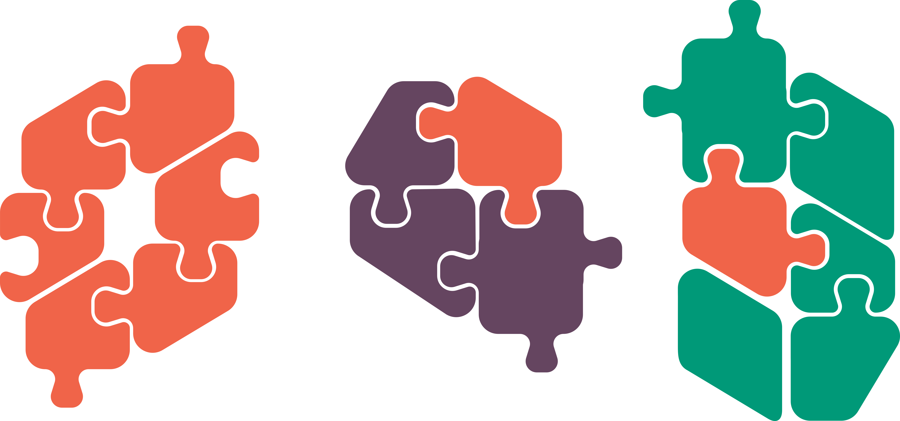

# Libraries {.unnumbered}

{fig-align="center" width=45%}

<p font-size=55pt align="center">
**Most of the power of python is in its libraries.**
</p>


A library contains functionality above and beyond those available as built-ins.

::: {.callout-important}
### A *library* is a collection of *modules*, but these terms are used interchangeably as libraries often only contain a single module.
:::

## Importing

A library's functionality needs to be brought into Python's working memory using the ```import``` keyword. Components can then be accessed using the ```.``` notation.

```{python}
# | echo: True
import math

print('pi is', math.pi)
print('cos(pi) is', math.cos(math.pi))
```

Individual modules or functions can be imported, allowing direct access:

```{python}
# | echo: True
from math import pi

print(pi)

```

## A note of caution

Another option is to *'alias'* a module when importing; this allows us to make programs more succint without loosing clarity.

```{python}
# | echo: True
import numpy as np
import pandas as pd
import seaborn as sns
type(sns.scatterplot)

```


A final way of importing from libraries that you may come across is the *star* import:

```{python}
# | echo: True
# | error: True
print(type(scatterplot))
```
```{python}
# | echo: True
# | error: True
from seaborn import *
print(type(scatterplot))

```

::: {.callout-important}

### This method is generally discouraged, as it polutes your *namespace* - the collection of symbolic names and objects that each name references
:::


## Some useful examples

::: {.columns}
::: {.column}

| Data manipulation |
|-----|
|[numpy](https://numpy.org/) |
|[scipy](https://scipy.org/) |
|[pandas](https://pandas.pydata.org/) |


| Data visualisation |
|-----|
|[matplotlib](https://matplotlib.org/)|
|[seaborn](https://seaborn.pydata.org/) |
|[bokeh](https://bokeh.org/) |
|[plotly](https://plotly.com/) |

:::
::: {.column}

| Image processing |
|-----|
|[openCV2](https://github.com/opencv/opencv-python)|
|[napari](https://napari.org/stable/) |
|[scikit-image](https://scikit-image.org/) |


| Machine learning |
|-----|
|[pytorch](https://pytorch.org/)|
|[keras](https://keras.io/)|
|[tensorflow](https://www.tensorflow.org/) |

:::
:::

::: {.callout-note}
### Anaconda comes preinstalled with many basic data science packages.
:::

## Finding and installing

Libraries can be found and installed from the Python Package Index ([PyPI](https://pypi.org/)) using package managers like ```pip``` or ```conda``` via the terminal. 

::: {.callout-note}
### A detailed discussion of [package management](https://realpython.com/python-virtual-environments-a-primer/) is a workshop of it's own! For now, you should be aware that not all versions of all packages can be installed simultaneously and there are ways to manage this using ```virtualenv``` or ```conda```. 
:::

::: {.callout-note}
### Jupyter also provides a special *magic* command ```%pip install ``` that allows you to install packages directly from a notebook, rather than through the terminal.
:::

## In practice 

::: {.callout-caution}

### Exercises

1.4 Importing common libraries

1.5 Installing additional libraries

:::


## Custom functions

We can also write our own functions! Custom functions encapsulate repetitive tasks into reusable blocks of code, break down complex problems into smaller manageable pieces, and make code cleaner and more modular.

{width="450" fig-align="center"} 

::: {.callout-note}
### Functions are an intermediate skill that improve code **readability**,  **reusability**, and allow **testing**. Learn more about custom functions [here](https://realpython.com/defining-your-own-python-function/).
:::
