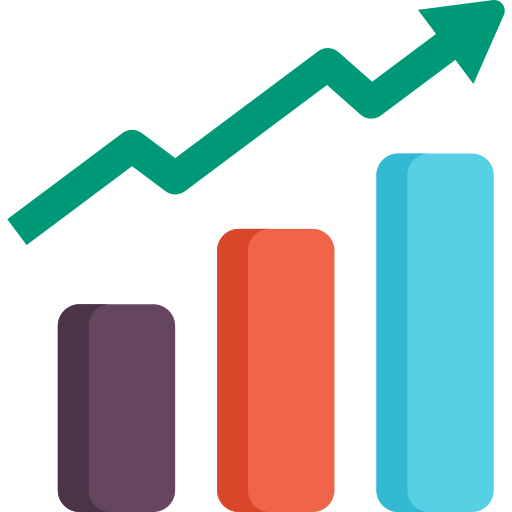
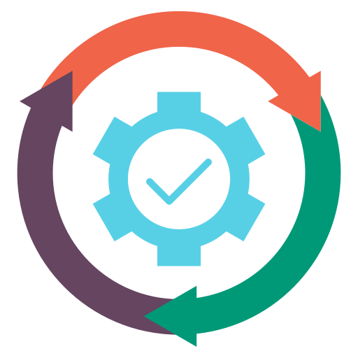

# RESOURCES {.unnumbered}


## Where to from here?

::: {.columns}
::: {.column width="20%"}
{width="100" fig-align="center"} 
:::
::: {.column width="80%"}
<h5 font-size=10pt align="left">[Fitting & statistics]()</h5>

Fit regression models, hypothesis testing 

🛠️ ```sciPy```, ```statsmodels```
:::
:::

::: {.columns}
::: {.column width="20%"}
{width="100" fig-align="center"} 
:::
::: {.column width="80%"}
<h5 font-size=10pt align="left">[Version control]()</h5>

Track changes, collaborate, publish

🛠️ ```Git```/```GitHub```, ```BitBucket```
:::
:::

::: {.columns}
::: {.column width="20%"}
{width="100" fig-align="center"} 
:::
::: {.column width="80%"}
<h5 font-size=10pt align="left">[Automation]()</h5>

Automate workflows and pipelines

🛠️ ```Snakemake```, ```Apache Airflow```
:::
:::


## Resources

<h3 font-size=50pt align="left">🧱 [RealPython](https://realpython.com)</h3>

Tutorials and guides for Python learners at all levels.  

<h3 font-size=50pt align="left">📚 [Automate the Boring Stuff with Python](https://automatetheboringstuff.com/)</h3>

Open-access book by Al Sweigart, more fundamentals and beginner-friendly introduction to automation  

<h3 font-size=50pt align="left">📚 [Python for Data Analysis](https://wesmckinney.com/book/)</h3>

Open-access book by Wes McKinney, great for building experience with data wrangling and visualisation

<h3 font-size=50pt align="left">🎓 [Machine Learning Crash Course](https://developers.google.com/machine-learning/crash-course)</h3>

Beginner-friendly intro to machine learning with interactive lessons and coding exercises 

