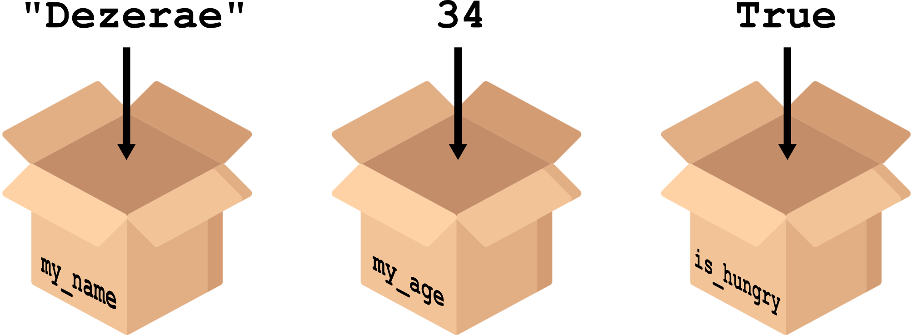

# Variables {.unnumbered}

Python stores information in named containers called **variables**. 

{fig-align="center" width=60%}

Values are *assigned* to a unique variable name using the ```=``` operator, where the name of the variable is on the left and the variable's value is on the right.

```{python}
# | echo: True
my_name = "Dezerae"
my_age = 628 - 594
```

You can see what python has stored for a given variable by passing it to the ```print()``` function:

```{python}
# | echo: True
my_name = "Dezerae"
print(my_name)
```

::: {.callout-important}
### Variables must be created before they are used. If a variable doesn’t exist yet, or if the name has been misspelled, Python reports an error. 
:::

## Naming conventions 

There are a few rules, and a few best practices when it comes to naming variables.

- [ ] 🎗️ should be meaningful so others (and future you!) will intuitively know what it is
- [ ] ✅ can only contain **letters, digits, and underscores**
- [ ] ⛔ cannot start with a digit
- [ ] 🔡 are case sensitive (```age```, ```Age``` and ```AGE``` are three different variables)

::: {.callout-note}
### The [Python style guide](https://peps.python.org/pep-0008/#:~:text=for%20that%20project.-,A%20Foolish%20Consistency%20is%20the%20Hobgoblin%20of%20Little%20Minds,-One%20of%20Guido%E2%80%99s) PEP-8 recommends lowercase letters for function and variable names, and ```snake_case``` for descriptive naming as opposed to ```CamelCase```. 
:::

::: {.callout-important}
### Variables are available once created until the kernel is stopped or restarted. This means that in Jupyter notebooks, variables persist between cells which can cause weird bugs if cells are executed out of order!
:::

## Types

All values have a ```type``` in python, which their containers (variables) inheret. 

{fig-align="center" width=60%}

So far, we have seen:

- **Integer** (```int```): represents positive or negative whole numbers.

- **Floating point number** (```float```): represents real numbers.

- **Character string** (```str```): a collection of text.

- **Boolean** (```bool```): either True or False


## Numerical operations

Numerical variables behave (mostly!) as you would expect.

We can perform mathematical operations with ```int``` and/or ```float``` variables as if they were values.
```{python}
# | echo: True
x = 11
print(f'half {x} is', x / 2.0)
print(f'{x} squared is', x ** 2)
print(f'one more than {x} is', x + 1)
print(f'7 less than {x} is', x - 7)
```

::: {.callout-note}
### Python has three types of division operator: ```/``` performs floating-point division, ```//``` performs integer (whole-number) floor division, ```%``` (or *modulo*) returns the remainder from integer division.
:::

## String operations

Strings can also be manipulated by the ```+``` and ```*``` operators.

```{python}
#| echo: True
my_name = 'Dezerae' * 5 + ' ' + 'Cox'
print(my_name)
```

::: {.callout-note}
### Strings also have a series of [special methods](https://docs.python.org/3/library/stdtypes.html#string-methods). 
:::

Sometimes numbers become strings which need to be converted:
```{python}
# | echo: True
print(1 + int('2'))
print(str(1) + '2')
```
::: {.callout-important}
### This is a *very* common issue when cleaning real-world data. It is always a good idea to check if your numerical variables are *actually* numerical!
:::

## Notes of caution

::: {.callout-important}
### Variables are only updated by reassignment, and are assigned in order.
:::

```{python}
# | echo: True
variable_one = 1
variable_two = 5 * variable_one
variable_one = 2
print('first is', variable_one, 'and second is', variable_two)
```

::: {.callout-important}
### Where reasonable, ```float()``` and ```int()``` will convert a string. However, if the conversion doesn’t make sense an error will occur.
:::

```{python}
#| error: True
print("string to float:", float("3.4"))
```
```{python}
#| error: True
print("float to int:", int(3.4))
```
```{python}
#| error: True
print("string to float:", float("Hello world!"))
```

## In practice

::: {.callout-caution}

### Exercises

1.6 Creating and printing variables

1.7 Numerical operations 

1.8 String operations 

1.9 Converting between types

:::